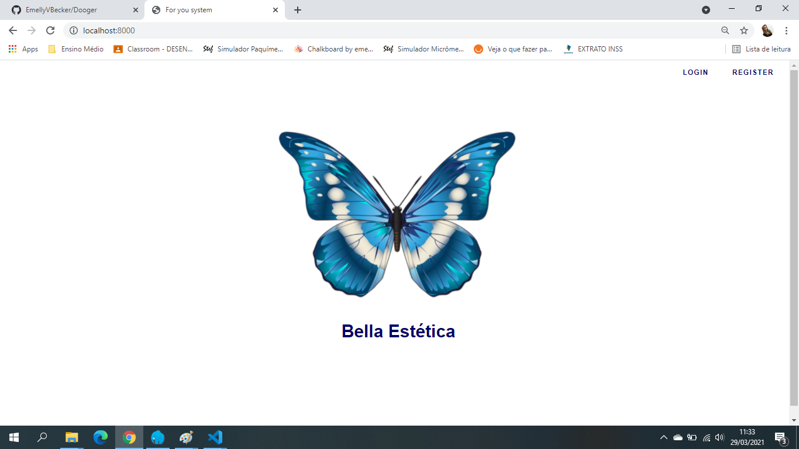
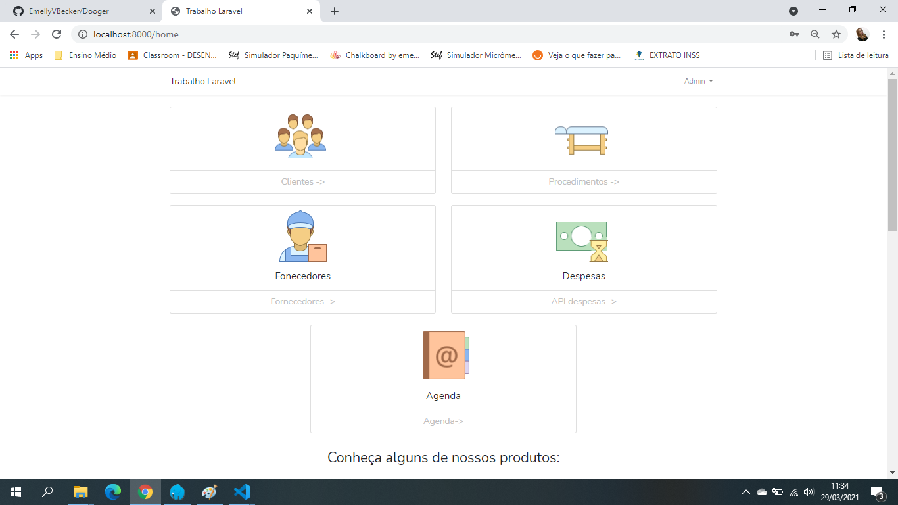
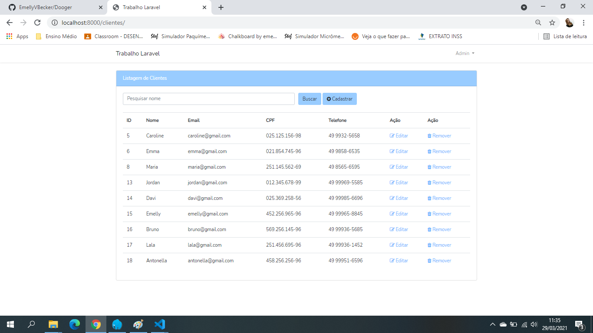

# Bella Estetica 
> Projeto desenvolvido durante as aulas de tópicos avançados em informática no curso técnico integrado do IFSC 2020.2

# Exemplo de uso
Sistema de uma clínica de estética

# Instalação
**Passo 01 - Clonar projeto**   
`git clone https://github.com/EmellyVBecker/Bella-Estetica`

**Passo 02 - Instala dependencias e pacotes do projeto**  
`composer install`

**Passo 03 - Gerar uma chave de desenvolvimento para o projeto Laravel**  
`php artisan key:generate`

**Passo 04 - Configurar o arquivo de conexão com o banco de dados**  
 > .env

**Realizer a migração criando as tabelas do banco de dados**  
`php artisan migrate`

**Iniciar o servidor**  
`php artisan serve`

**Criar um arquivo de migração referenciando uma tabela**  
`php artisan make:migration create_table_nome_tabela --create=nome_tabela`

**Criar um Model e o -m já cria um arquivo de migração**  
`php artisan make:model NomeModel -m`

**Criar um Controller e o --model associa com o Model da tabela**  
`php artisan make:controller NomeTabelaController --resource --model=NomeTabelaModel`

**Executa a insersão dos registros no banco de dados de tudo que esta dentro do database/seeds/DatabaseSeeder.php**  
`php artisan db:seed`

**Executa a insersão dos registros no banco de dado, de forma separada por Classe**  
`php artisan db:seed --class=NomeTabelaSeeder`

## Meta
Emelly Becker  – emellyvbecker@gmail.com

[https://github.com/EmellyVBecker/BellaEstetica](https://github.com/EmellyVBecker)

## Contributing

1. Fork it (<https://github.com/EmellyVBecker/BellaEstetica/fork>)
2. Create your feature branch (`git checkout -b feature/fooBar`)
3. Commit your changes (`git commit -am 'Add some fooBar'`)
4. Push to the branch (`git push origin feature/fooBar`)
5. Create a new Pull Request

<!-- Markdown link & img dfn's -->
[npm-image]: https://img.shields.io/npm/v/datadog-metrics.svg?style=flat-square
[npm-url]: https://npmjs.org/package/datadog-metrics
[npm-downloads]: https://img.shields.io/npm/dm/datadog-metrics.svg?style=flat-square
[travis-image]: https://img.shields.io/travis/dbader/node-datadog-metrics/master.svg?style=flat-square
[travis-url]: https://travis-ci.org/dbader/node-datadog-metrics
[wiki]: https://github.com/yourname/yourproject/wiki
